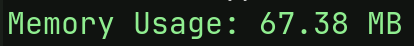

# Universal Scripts - Utils

## Overview
The `Utils` class provides various utility functions for debugging, logging, encryption, memory management, and configuration handling. It supports both **GDScript** and **C#**, allowing seamless integration into Godot projects regardless of the scripting language used.

## Features
- **Debugging & Logging**: Display dynamic log messages with visual effects.
- **Encryption**: AES encryption in different modes (XOR, ECB, CBC) for secure data storage.
- **Memory Monitoring**: Track RAM and VRAM usage.
- **Configuration Management**: Save and load settings in an `.ini` file.
- **Type Handling**: Format and colorize different data types for improved readability.

## Installation
Copy the `Utils` script into your Godot project's script directory. The library supports **both GDScript and C#**.

---

## Usage

### **Delay Your Function Calls**

#### **GDScript**
```gdscript
Utils.delayCall(2.0, self, "myFunction")

func myFunction():
    print("This runs after 2 seconds!")

```

#### **C#**
```csharp
Utils.DelayCall(2.0f, this, "MyFunction");

void MyFunction()
{
    GD.Print("This runs after 2 seconds!");
}

```

---

### **Saving and Loading Game Data**

#### **GDScript**
```gdscript
# Save game data
Utils.saveGame({"player_health": 100, "level": 3}, 1, Utils.ENCRYPTIONMODE.CBC)

# Load game data
var data = Utils.loadGame(1, Utils.ENCRYPTIONMODE.CBC)
print(data)
```

#### **C#**
```csharp
// Save game data
Godot.Collections.Dictionary<string, Godot.Variant> gameData = new Godot.Collections.Dictionary<string, Godot.Variant>
{
    {"player_health", 100},
    {"level", 3}
};
Utils.SaveGame(gameData, 1, Utils.ENCRYPTIONMODE.CBC);

// Load game data
Godot.Collections.Dictionary<string, Godot.Variant> newData = Utils.LoadGame(1, Utils.ENCRYPTIONMODE.CBC);
GD.Print(newData);
```

---

### **Configuration Management**

#### **Saving Configuration**
##### **GDScript**
```gdscript
var settings = {
    "Audio": {
        "music": 5,
        "voice": 7,
        "sfx": 4
    }
}
Utils.saveConfig(settings)
```

##### **C#**
```csharp
Godot.Collections.Dictionary<string, Godot.Collections.Dictionary<string, Godot.Variant>> settings = 
    new Godot.Collections.Dictionary<string, Godot.Collections.Dictionary<string, Godot.Variant>>
{
    {"Audio", new Godot.Collections.Dictionary<string, Godot.Variant>
        {
            {"music", 5},
            {"voice", 7},
            {"sfx", 4}
        }
    }
};
Utils.SaveConfig(settings);
```

#### **Loading Configuration**
##### **GDScript**
```gdscript
Utils.loadConfig(settings)
```
##### **C#**
```csharp
Utils.LoadConfig(settings);
```

---

### **Type Formatting & Colorization**
The `Utils` class provides functions to format values for debugging:


---

## **Screenshots & Examples**

#### Rainbow Logs


#### Pulsate Logs
Pulsates between white and colour of choice


#### Gradient Logs
Logs with a gradient of your two colour choices


#### Highlight Logs
Highlight a log entry for easy viewing


#### printPretty
Easy to read with colour coded data types


#### printType
Logged data types instead of mysterious numbers you have to lookup


#### logMemory
Keep track of the alotted memory at any point without changing tabs or remembering to enable graphs


#### logFPS
Easy to grab FPS


#### logVRAM and logTenderingStats


---

## License
This project is licensed under the MIT License.

## Contributions
Contributions are welcome! Feel free to submit pull requests or report issues.

